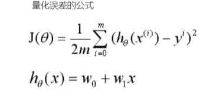
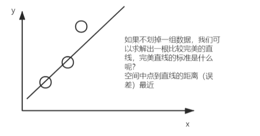
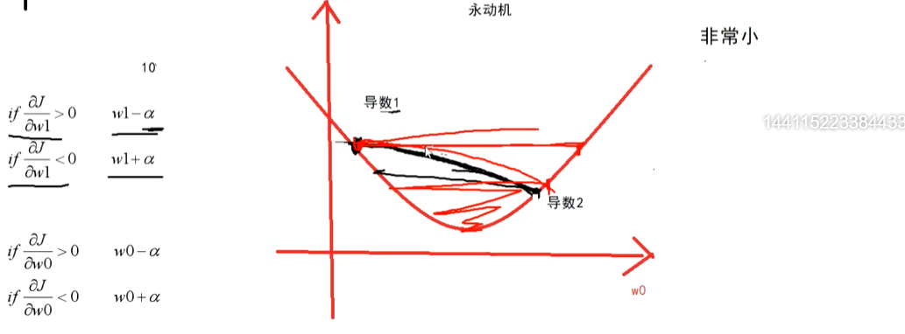
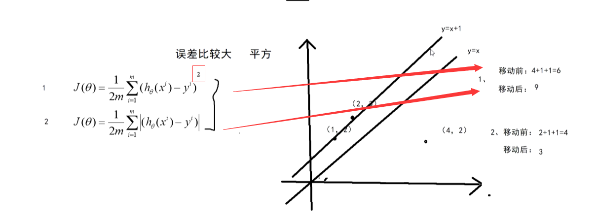
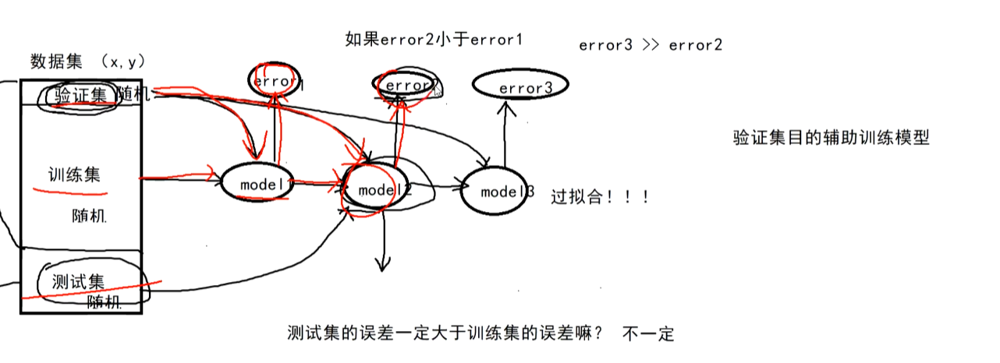

#机器学习基础知识

 - 目标函数
   - 
   - 
   - 想要求解这个误差函数是否有最小值，需要了解 w 变量和 J 函数的的形状 ，J函数的函数类型是： 凹函数还是凸函数？
 - 目标函数的优化
   - 两种方法：
       - **梯度下降法** ： 求导后的数据，***参与到与目前w值相减***，然后进行梯度下降
         1. 
       - **采用平法差法**： 平方差方法解决过拟合问题
         1. 
       - **划分数据集**：过拟合之前训练的model 是相对误差较少的
         1. 
